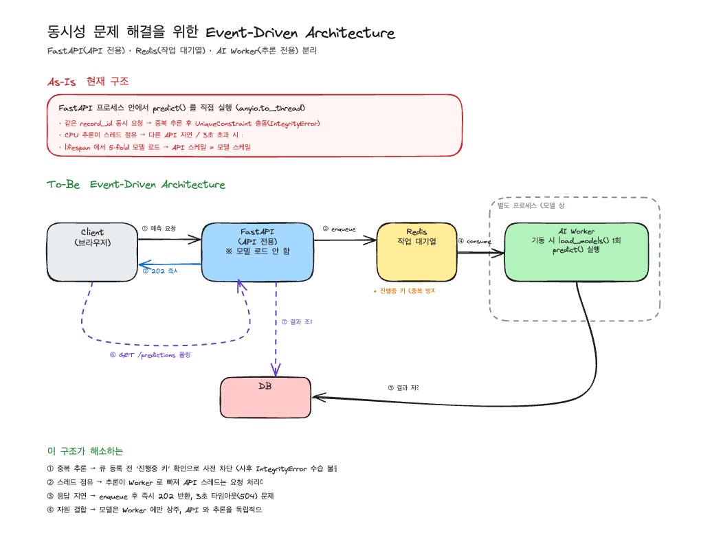

# 프로젝트 진행 단계 정리 — 권병학

> 폐렴 관리 백오피스 프로젝트를 10개 단계로 나누어 정리한 문서입니다.
> 인용한 파일 경로·설정값·상수는 모두 현재 리포지토리를 직접 확인해 근거로 삼았습니다.
> 팀이 함께 진행한 단계와 제가 담당한 부분을 구분해 표기했습니다.

---

## 진행 단계 한눈에 보기

| 단계 | 내용 | 상태 | 내 담당 |
|---|---|---|---|
| 1 | Team Rule 정의 | 완료 | 팀 공동 |
| 2 | 사용자 요구사항 정의 | 완료 | 팀 공동 |
| 3 | API 명세서 작성 | 완료 | 마이페이지 3종, 환자 수정·삭제 |
| 4 | Git & GitHub Branch 전략 | 완료 | 팀 공동 |
| 5 | 프로젝트 세팅 | 완료 | 뜯어보기 2번 파트, users 모델·enums |
| 6 | API 및 AI 워커 코드 작성 후 Branch 전략을 통한 코드 병합 | 완료 | **AI 예측 모델**, **프론트 연결(record-detail·admin-users)** |
| 7 | 아키텍처 설계 및 적용 | 완료 | **EDA 설계 문서** (적용 코드는 팀) |
| 8 | 도커 인프라 관련 파일 작성 | 완료 | 팀 담당 |
| 9 | AWS 배포 | **예정 — 아직 진행하지 않음** | – |
| 10 | QA 진행 | **예정 — 아직 진행하지 않음** | – |

---

## 1. Team Rule 정의

코드를 쓰기 전에 팀이 공유할 협업 기준부터 합의했습니다.
브랜치·커밋·PR·코드리뷰처럼 매일 부딪히는 규칙을 먼저 못박아 두면
나중에 "이건 어떻게 하기로 했지?"로 시간을 쓰지 않아도 되기 때문입니다.

### 합의 항목

코어 타임·회의 방식·불참 공유부터 Git 규칙, Conflict 해결, 업무 기록까지 11개 항목으로 정리했습니다.

### 커밋·PR 규칙

| 항목 | 규칙 |
|---|---|
| 커밋 메시지 | `[#이슈번호] 타입: 내용` — 타입은 `feat`/`fix`/`docs`/`refactor`/`test`/`chore`/`style` |
| 브랜치 이름 | `feat/기능명`, `fix/수정내용`, `docs/문서내용` 형식 |
| PR | 본문에 작업 내용·테스트 방법·관련 이슈 작성 |
| 리뷰 | 최소 1인 승인 후 merge, 리뷰 전 임의 merge 금지 |
| 리뷰 구분 | `[필수]` 오류·보안·요구사항 미충족 / `[제안]` 가독성·구조 / `[질문]` 의도 확인 |

`main` 직접 push는 금지하고, 긴급 수정도 `fix/작업명` 브랜치를 거치도록 했습니다.

**산출물** — `docs/1일차/1일차_team_rules.md`

---

## 2. 사용자 요구사항 정의

제공된 요구사항 문서를 팀이 함께 읽고 도메인별로 나눈 뒤, 요구사항 ID 단위로 담당을 배분했습니다.
문서를 쪼개서 나누지 않고 **ID 단위로 나눈 것**이 이후 병렬 작업의 기준이 되었습니다.

### 요구사항 ID 체계

| 접두사 | 도메인 |
|---|---|
| `REQ-USER-*` | 회원 (가입·인증·마이페이지·권한) |
| `REQ-PTNT-*` | 환자 관리 |
| `REQ-MDR-*` | 진료기록 |
| `REQ-PRED-*` | 폐렴 예측 |

이 ID는 이후 설계서·명세서 파일명과 본문, 커밋 메시지에까지 그대로 이어집니다.
예를 들어 제가 담당한 환자 수정·삭제는 `REQ-PTNT-004/005`로 커밋과 문서가 묶여 있습니다.

> 요구사항 원본 문서는 외부에서 제공받은 것이라 리포지토리에는 포함되어 있지 않습니다.

---

## 3. API 명세서 작성

배분받은 요구사항 ID 단위로 각자 API 설계서와 명세서를 작성했습니다.
같은 도메인이라도 담당 ID가 다르면 **문서를 따로 만들어** 문서 충돌 없이 동시에 작업할 수 있게 했습니다.

### 도메인별 산출물

| 폴더 | 도메인 | 문서 수 |
|---|---|---|
| `docs/4일차/` | 회원 (공통 인증·인가, 회원가입/탈퇴, USER API 설계) | 5건 |
| `docs/5일차/` | 환자·진료기록 (환자관리, 환자목록조회, 진료기록 등록) | 6건 |
| `docs/6일차/` | 폐렴예측 | 2건 |

### 내가 작성한 문서

- 마이페이지 API 명세 3종 — 내 정보 조회 / 수정 / 비밀번호 변경 (`[#25]`)
- 환자 수정·삭제 API 및 명세 — `REQ-PTNT-004/005` (`[#35]`)

**산출물** — `docs/4일차/4일차_USER_API_설계.md`, `docs/5일차/5일차_환자관리_API_설계_REQ_PTNT_04_05.md` 외

---

## 4. Git & GitHub Branch 전략

1일차 규칙은 `main` 기준의 단순한 형태(GitHub Flow에 가까움)였습니다.
팀 인원이 늘고 작업이 겹치면서 통합 브랜치가 필요해져, Git Flow 기반으로 다시 정의했습니다.

### 브랜치 5종

| 브랜치 | 역할 | 분기 위치 | merge 대상 |
|---|---|---|---|
| `main` | 배포 가능한 안정 버전만 유지 | – | – |
| `develop` | 다음 릴리스 통합 브랜치 | `main` | – |
| `feat/*`, `fix/*`, `docs/*` | 실제 작업 단위 | `develop` | `develop` |
| `release/vX.Y.Z` | 배포 준비 (QA, 버전 정리) | `develop` | `main` + `develop` |
| `hotfix/*` | 운영 중 긴급 버그 수정 | `main` | `main` + `develop` |

핵심 변경점은 **작업 브랜치의 분기·PR 기준을 `main` → `develop`으로 옮긴 것**입니다.
커밋 메시지 규칙과 PR 1인 승인 규칙은 1일차 그대로 유지했습니다.

### 실제 운영

```bash
git checkout develop
git pull origin develop
git checkout -b feat/기능명
# 작업 후
git commit -m "[#12] feat: 기능 설명"
git push origin feat/기능명
# → develop 대상 PR → 리뷰 1인 승인 → merge
```

제 작업도 전부 이 흐름을 따랐습니다 (`feat/day4-mypage-user-api`, `feat/day5-patient-update-delete`,
`feat/day6-worker-model`, `feat/day7-connect-record-admin`, `docs/stage2-eda-architecture`).

**산출물** — `docs/2일차/2일차_git_branch_전략.md`

---

## 5. 프로젝트 세팅

초기 템플릿을 받아 팀이 함께 구조를 뜯어보고, 각 디렉터리와 파일의 역할을 문서로 남겼습니다.
남의 코드를 이어받아 작업하려면 계층 책임을 먼저 합의해야 한다고 봤기 때문입니다.

### 계층 구조 파악

| 계층 | 책임 |
|---|---|
| `app/apis/` | 라우터 — 요청 수신, 상태 코드 결정 |
| `app/schemas/` | 요청/응답 검증 (Pydantic) |
| `app/services/` | 비즈니스 로직 |
| `app/repositories/` | DB 접근 (CRUD) |
| `app/models/` | SQLAlchemy ORM 모델 |
| `app/core/db/` | 비동기 엔진·세션 팩토리·의존성 주입 |

저는 이 문서의 **2번 파트(각 파일의 역할)** 를 맡아 작성했습니다 (`[#13]`).

### DB 모델과 마이그레이션

SQLAlchemy 모델을 작성하고 Alembic으로 스키마를 구성했습니다.
저는 `users` 모델과 팀 공용 `enums`를 담당했습니다 (`[#12]`).

```python
# app/models/enums.py — 팀 공용 enum (서버는 전부 대문자)
class Gender(str, enum.Enum):     M / F
class Role(str, enum.Enum):       PENDING / STAFF / ADMIN
class Department(str, enum.Enum): MEDICAL / DEV / RESEARCH
```

이 enum의 **대문자 규칙**이 7단계 프론트 연결에서 실제 버그의 원인이 됩니다(6단계 참고).

**산출물**
- `docs/3일차/3일차_프로젝트_뜯어보기.md` (2번 파트 담당)
- `docs/3일차/3일차_db_migration.md`
- `app/models/user.py`, `app/models/enums.py`

---

## 6. API 및 AI 워커 코드 작성 후 Branch 전략을 통한 코드 병합

각자 담당 API를 작업 브랜치로 나누어 구현하고 PR 리뷰를 거쳐 `develop`에 병합했습니다.
제가 맡은 부분은 **AI 폐렴 예측 모델 이식**과 **프론트엔드 연결(record-detail·admin-users)** 입니다.

### 6.1 AI 예측 모델 이식 — `worker/model.py`

해커톤 v7 노트북(`chest_xray_v7_mission7.ipynb`)에서 **추론 경로만** 서버용으로 이식했습니다.
학습 코드는 전부 제외하고 전처리 → 멀티스케일 TTA → 5-fold 앙상블 → `predict()` 만 담았습니다.

노트북 대비 바꾼 것은 3가지입니다.

| 항목 | 노트북 | 서버 |
|---|---|---|
| 입력 | pandas DataFrame (배치) | 이미지 파일 경로 1장 |
| 출력 | 제출 CSV | dict 1개 |
| 디바이스 | GPU / autocast 전제 | **CPU (fp32)** — autocast·GradScaler·cuda 코드 전부 제거 |

### 6.2 모델 상수

```python
BACKBONE   = "densenet121"
FOLDS      = 5                          # fold0~4.pth
SCALES     = (224, 256, 288)            # 멀티스케일 TTA
MODEL_TAG  = "v7_densenet121_5fold"     # ai_model 필드로 응답·저장됨
CLAHE_OP   = cv2.createCLAHE(clipLimit=2.0, tileGridSize=(8, 8))
```

### 6.3 전처리 파이프라인

전처리 파라미터가 학습과 다르면 입력 분포가 달라져 **Recall이 조용히 떨어집니다.**
그래서 순서와 파라미터를 노트북 값 그대로 고정하고, 코드에 경고를 남겼습니다.

```
1) Nyúl 히스토그램 표준화   nyul_map(gray, S_REF)
   └ landmark 분위수 [1,10,20,...,90,99] → train 기준 S(hist_ref.npz)로 piecewise-linear 매핑
2) CLAHE                    clipLimit=2.0, tileGridSize=(8,8)   ← 표준화 後 적용
3) 3채널 복제               np.stack([g,g,g], axis=-1)
4) Resize(s,s) → ImageNet 정규화 → ToTensorV2   (s ∈ 224/256/288)
```

기준 히스토그램 `hist_ref.npz`의 분위수가 코드 상수와 어긋나면 즉시 실패하도록 `assert`를 넣었습니다.

### 6.4 추론과 반환 스키마

3 scale × 5 fold = **15회** softmax 확률을 평균해 폐렴(class 1) 확률을 냅니다.
전체가 `@torch.no_grad()` 안에서 동작합니다.

```python
return {
    "is_pneumonia": bool(prob >= 0.5),
    "confidence":   round(prob * 100, 2),   # DB Numeric(5,2) 정합
    "ai_model":     MODEL_TAG,
}
```

`confidence`는 '폐렴일 확률'(0~100)이며, `is_pneumonia=False`여도 그 확률(0.5 미만)을 그대로 둡니다.
'예측한 클래스의 확신도'로 바꿀 경우의 대안도 주석으로 남겨 팀이 고를 수 있게 했습니다.

### 6.5 모델 로딩 — global 캐싱

```python
_FOLD_MODELS = None

def load_models():
    global _FOLD_MODELS
    if _FOLD_MODELS is not None:
        return _FOLD_MODELS          # 프로세스당 1회만 로드
    ...  torch.load(path, map_location="cpu") → load_state_dict → eval()
```

5-fold를 매 요청 로드하면 추론보다 로딩이 더 비싸지므로 모듈 전역에 캐싱했습니다.
앱 import 시점이 아니라 **최초 `predict()` 호출 때 lazy 로드**하도록 해,
테스트나 다른 API 기동이 모델 로딩에 붙잡히지 않게 했습니다.

> 이 "모델이 프로세스 메모리에 상주한다"는 성질이 7단계에서 **자원 결합 문제**로 이어집니다.

### 6.6 프론트엔드 연결 — record-detail · admin-users

`[#62]` / PR `#63`으로 담당했습니다. 서버 응답을 실제로 붙여보며 드러난 불일치를 맞추는 작업이었습니다.

**① 응답이 배열이 아니라 페이지네이션 구조였다**

프론트는 처음에 예측 결과를 배열로 가정하고 순회했는데, 서버 응답은 페이지네이션 래퍼였습니다.

```python
# app/schemas/prediction.py
items: list[PredictionResultItem]
page:  int
size:  int
total: int
```

`items`를 순회하도록 고쳤습니다. 회원 목록(`GET /admin/users`)도 같은 구조라 동일하게 맞췄습니다.

```javascript
// static/pages.js
const { items: patients, total, page, size } = response;
```

**② 서버 enum(대문자)과 프론트 값(소문자)이 불일치했다**

부서 필터의 option value가 `developer` / `medical team` / `researcher`였는데,
서버 `Department` enum은 `DEV` / `MEDICAL` / `RESEARCH`입니다.
필터를 걸면 **422**가 났고, option value를 서버 enum에 맞춰 해결했습니다.

**③ 그 외 정정 사항**

| 문제 | 수정 |
|---|---|
| 예측 경로가 `…/predict` | `…/predictions` 로 정정 |
| 수행 일시를 `created_at`으로 읽음 | 서버 필드명 `predicted_at` 사용 |
| 검색 파라미터 `query` (서버가 무시) | `search` 로 정정 |
| role 드롭다운 preselect 시도 | 목록 응답에 `role` 미포함(REQ-USER-004 스펙)이라 불가 → "권한 변경" placeholder UI로 변경 + 빈 role 전송 가드 추가 |

변경 범위는 프론트(`static/`)만이고 백엔드·DB는 건드리지 않았습니다.

**산출물**
- `worker/model.py`, `worker/_verify_against_notebook.py` (노트북 정답 대조 검증)
- `worker/models/fold0~4.pth`, `worker/models/hist_ref.npz`
- `static/pages.js`, `static/apis.js`, `static/templates/`
- `docs/7일차/7일차_앱_실행화면.md` — 화면별 실행 결과 및 검증 요약

---

## 7. 아키텍처 설계 및 적용

AI 추론이 API 요청 처리를 붙잡는 동시성 문제를 정리하고 해결 아키텍처를 설계했습니다.
**설계 문서는 제가 작성**했고(`[#76]` / PR `#77`), **적용 코드는 팀원들이 구현**했습니다.

### 7.1 As-Is — 정리한 문제 4가지

당시 예측은 `POST /api/v1/medical-records/{record_id}/predictions` 요청 안에서
동기(inline)로 추론을 수행했습니다. 여기서 문제 4가지를 코드 근거와 함께 정리했습니다.

**① 중복 추론**

같은 `record_id`에 동시에 요청이 오면 둘 다 캐시 미스가 되어 각자 무거운 추론을 수행합니다.
저장 시점에 아래 제약으로 뒤늦은 쪽이 `IntegrityError`를 만나고, 코드가 이를 잡아 재조회합니다.

```python
# app/models/ai_analysis_result.py
UniqueConstraint("record_id", "ai_model", name="uq_ai_analysis_results_record_model")
```

즉 **정합성은 지켜지지만 추론은 이미 두 번 돌았습니다.** 사후 수습일 뿐 중복 실행 자체는 못 막습니다.

**② 스레드풀 점유**

CPU-bound 동기 함수인 `predict()`를 이벤트 루프에서 떼어내기 위해 스레드에 위임했습니다.

```python
await anyio.to_thread.run_sync(predict, image_path, abandon_on_cancel=True)
```

하지만 워커 스레드 풀에는 한도가 있고, 추론은 CPU-bound라 GIL 때문에
**스레드를 늘려도 처리량이 비례해 늘지 않습니다.** 결국 다른 요청까지 대기가 생깁니다.

**③ 응답 지연**

추론이 끝날 때까지 HTTP 요청이 열린 채 대기합니다. 그래서 이미 타임아웃 방어가 있었습니다.

```python
# app/apis/predictions.py
PREDICTION_API_TIMEOUT_SECONDS = 3.0   # 초과 시 504 GATEWAY_TIMEOUT
```

추론 시간이 3초에 가까워질수록 사용자 대기와 504 실패 위험이 커집니다.

**④ 자원 결합**

`load_models()`가 5-fold 모델을 **API 프로세스 메모리에 상주**시킵니다.
트래픽 때문에 API를 늘리면 모델도 프로세스마다 함께 올라가,
**API 확장 단위와 추론 확장 단위가 묶입니다.** 반대로 추론 자원만 늘리기도 어렵습니다.

### 7.2 To-Be — 설계

FastAPI(요청 처리) / Redis(작업 대기열) / AI Worker(추론)를 분리하고,
API는 모델을 로드하지 않으며 워커만 `load_models()`를 1회 호출하도록 설계했습니다.
중복 방지는 DB 제약에 기대는 사후 수습에서 **큐 등록 전 차단**으로 옮기고,
`UniqueConstraint`는 최종 안전장치로 남기기로 했습니다.



도식은 As-Is와 To-Be를 나란히 보여줍니다. 원본은 `docs/assets/day9-eda-architecture.excalidraw`입니다.

### 7.3 적용 결과 (팀 구현)

설계 이후 팀이 Redis 기반으로 실제 적용했습니다. 현재 코드 기준 흐름입니다.

```
FastAPI  ──LPUSH──▶  xray:task_queue  ──BRPOP──▶  AI Worker
   ▲                                                  │
   └──SUBSCRIBE──  xray:result:{task_id}  ◀─PUBLISH───┘
```

| 상수 | 값 | 위치 |
|---|---|---|
| `TASK_QUEUE` | `xray:task_queue` | `app/core/redis_client.py`, `worker/redis_client.py` |
| `RESULT_CHANNEL_PREFIX` | `xray:result:` | 동일 (양쪽 동일 값 사용) |
| `DEFAULT_RESULT_TIMEOUT_SECONDS` | `60.0` | `app/core/redis_client.py` (`PREDICTION_TIMEOUT_SECONDS` 환경변수로 override) |
| `REDIS_URL` 기본값 | `redis://redis:6379/0` | `app/core/redis_client.py` |

설계에서 지적한 **④ 자원 결합**은 해소됐습니다. `app/main.py`의 `lifespan`에는
`load_models()` 호출이 없고 Redis 연결 정리만 남아, 모델은 워커 프로세스만 로드합니다.

```python
# app/main.py
async def lifespan(app: FastAPI):
    try:
        yield
    finally:
        await redis_client.redis.aclose()
```

`app/services/prediction_service.py`의 추론 호출도 `anyio.to_thread.run_sync`에서
`redis_client.enqueue_and_wait`로 바뀌어 **② 스레드풀 점유**도 해소됐습니다.

워커는 `while True`로 큐를 소비하며, 실패 시 결과 채널에 에러를 발행하고
Redis 연결이 끊기면 5초 후 재연결합니다(`worker/main.py`).

> **설계와 다르게 적용된 부분** — 설계는 `202 Accepted` + 폴링이었지만,
> 현재 구현은 `enqueue_and_wait`로 결과를 기다렸다가 `200/201`로 반환합니다.
> API 계약과 프론트를 바꾸지 않으려는 선택으로 보이며, 그 결과
> **③ 응답 지연**(3초 타임아웃 → 504)은 아직 남아 있습니다.
> **① 중복 추론**의 사전 차단 키도 아직 들어가지 않아, `UniqueConstraint` +
> `IntegrityError` 재조회 방식이 그대로 유지되고 있습니다.

**산출물**
- `docs/9일차/9일차_동시성문제_해결을위한_아키텍처설계_권병학.md` (설계, 내 담당)
- `docs/assets/day9-eda-architecture.png` / `.excalidraw` (도식, 내 담당)
- `app/core/redis_client.py`, `worker/main.py`, `worker/redis_client.py` (적용, 팀)

---

## 8. 도커 인프라 관련 파일 작성

로컬 환경 차이 없이 전체 스택을 실행할 수 있도록 컨테이너화했습니다. **팀원들이 담당한 단계**입니다.

### 8.1 서비스 구성

| 서비스 | 이미지 / 빌드 | healthcheck | depends_on |
|---|---|---|---|
| `fastapi` | `app/Dockerfile` | `/healthcheck` HTTP 확인 (5s, 10회) | `mysql`·`redis` **service_healthy** |
| `mysql` | `mysql:8.0` | `mysqladmin ping` (10s, 10회) | – |
| `redis` | `redis:7-alpine` | `redis-cli ping` (5s, 5회) | – |
| `ai-worker` | `worker/Dockerfile` | – | `redis` **service_healthy** |

`depends_on`에 `condition: service_healthy`를 걸어 DB·Redis가 실제로 응답 가능해진 뒤
FastAPI가 마이그레이션(`alembic upgrade head`)을 돌리도록 순서를 보장했습니다.
`ai-worker`는 `restart: unless-stopped`로 두어 예외 종료 시 자동 복구되게 했습니다.

### 8.2 의존성 그룹 분리

`pyproject.toml`에서 앱과 AI 의존성을 나눠, 각 이미지가 필요한 것만 설치하도록 했습니다.

| 그룹 | 주요 패키지 |
|---|---|
| `[project].dependencies` | `redis` (양쪽 공통) |
| `app` | fastapi[standard], sqlalchemy[asyncio], alembic, asyncmy, passlib[bcrypt], python-jose, pydantic-settings 등 |
| `ai` | torch, torchvision, albumentations, opencv-python-headless, numpy, pillow |

FastAPI 이미지는 `--group app`, 워커 이미지는 `--only-group ai`로 export해 설치합니다.
덕분에 API 이미지에 torch가 들어가지 않습니다.

### 8.3 멀티스테이지 + `/opt/venv`

두 Dockerfile 모두 `builder` / `runtime` 2단계로 나눠, 빌드 도구(`build-essential`)를
최종 이미지에 남기지 않고 완성된 가상환경만 복사합니다.

```dockerfile
FROM python:3.13-slim AS builder
RUN uv venv /opt/venv && uv pip install --python /opt/venv -r /tmp/requirements.txt

FROM python:3.13-slim AS runtime
COPY --from=builder /opt/venv /opt/venv
```

의존성을 **`/opt/venv`(앱 경로 밖)** 에 설치하는 것이 핵심입니다.
`docker-compose.yml`이 개발 편의를 위해 프로젝트를 `.:/app`으로 마운트하는데,
`/app` 안(`.venv` 등)에 설치하면 **마운트가 그 위를 덮어써서 패키지가 사라집니다.**
그래서 실행 명령도 `/opt/venv/bin/uvicorn`, `/opt/venv/bin/alembic`처럼 절대경로를 씁니다.

### 8.4 워커 이미지 경량화 — CPU 전용 torch

`torch`·`torchvision`을 기본 인덱스에서 설치하면 **nvidia/cuda 패키지가 함께 딸려옵니다.**
서버는 CPU 추론만 하므로(6단계에서 cuda 코드를 전부 제거) 이 용량이 전부 낭비입니다.

`worker/Dockerfile`은 lock에서 export한 뒤 GPU 관련 항목을 걸러내고,
CPU 전용 인덱스에서 torch를 따로 설치합니다.

```dockerfile
uv export --frozen --no-dev --no-hashes --no-emit-project --only-group ai \
    | grep -viE '^(torch|torchvision|triton|pytorch-triton)([=<>~!; ]|$)|^(nvidia|cuda)-' \
    > /tmp/ai_requirements.txt \
&& uv pip install --python /opt/venv redis -r /tmp/ai_requirements.txt \
&& uv pip install --python /opt/venv \
    --index-url https://download.pytorch.org/whl/cpu \
    torch torchvision
```

OpenCV 실행에 필요한 `libgl1`·`libglib2.0-0`만 runtime에 남기고 나머지 apt 캐시는 삭제합니다.

> 이미지 용량 감소분은 수치로 적지 않았습니다. 문서 작성 시점에 Docker 데몬이 실행 중이 아니어서
> 직접 측정하지 못했고, 측정하지 않은 값을 적지 않기 위해서입니다.

**산출물** — `app/Dockerfile`, `worker/Dockerfile`, `.dockerignore`, `docker-compose.yml`,
`docs/8일차/8일차 Docker 컨테이너화.md`

---

## 9. AWS 배포

**예정 — 아직 진행하지 않음.**

컨테이너화까지 완료했으므로, 이후 AWS 환경에 배포할 계획입니다.
현재 리포지토리에는 배포 관련 설정이나 문서가 없습니다.

---

## 10. QA 진행

**예정 — 아직 진행하지 않음.**

배포 환경에서 요구사항 ID(`REQ-USER-*` / `REQ-PTNT-*` / `REQ-MDR-*` / `REQ-PRED-*`) 기준으로
QA를 진행할 계획입니다. 7단계에서 남은 과제(중복 추론 사전 차단, 3초 타임아웃)도
이 시점에 함께 점검할 필요가 있습니다.

---

## 정리

문서와 코드를 요구사항 ID·담당자 단위로 잘게 나눈 것이 이 프로젝트에서 가장 효과가 컸습니다.
파일이 겹치지 않으니 5명이 같은 폴더를 동시에 건드려도 충돌이 거의 나지 않았고,
9일차 EDA 설계처럼 5명이 같은 주제를 각자 쓰는 경우에도 파일명에 담당자명을 붙여 그대로 공존시켰습니다.

기술적으로는 6단계의 모델 이식과 7단계의 설계가 이어진 점이 남습니다.
`load_models()`를 프로세스 전역에 캐싱한 선택이 성능에는 맞았지만
동시에 "모델이 API 프로세스에 상주한다"는 구조적 제약을 만들었고,
그 제약을 다음 단계에서 EDA로 풀어냈습니다.
