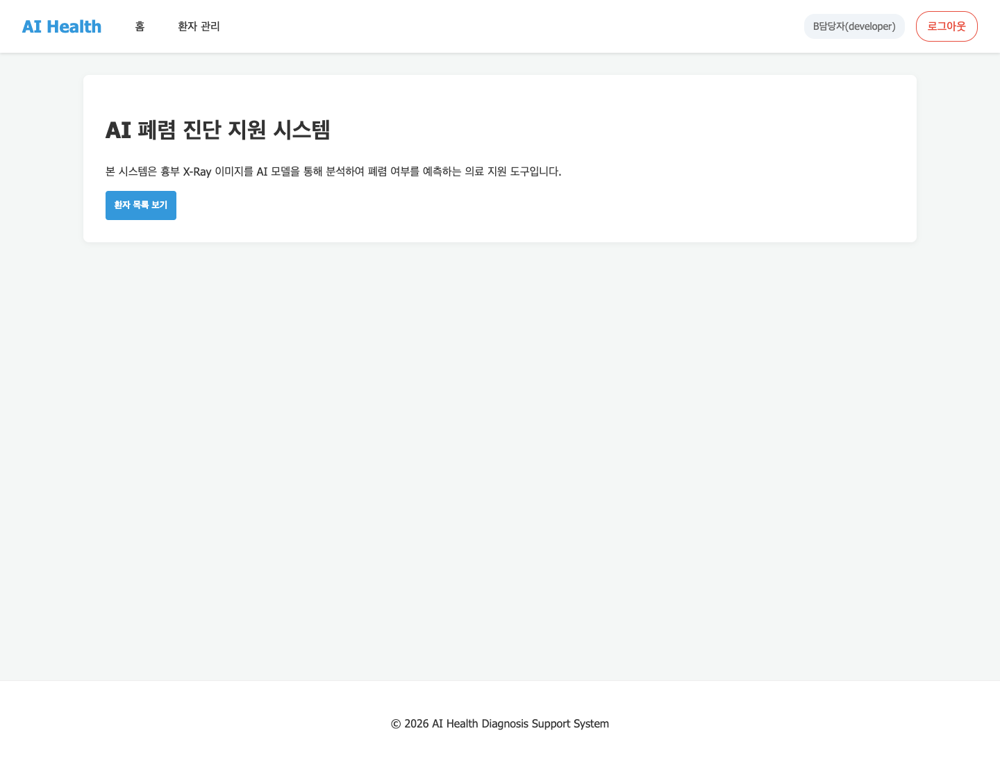
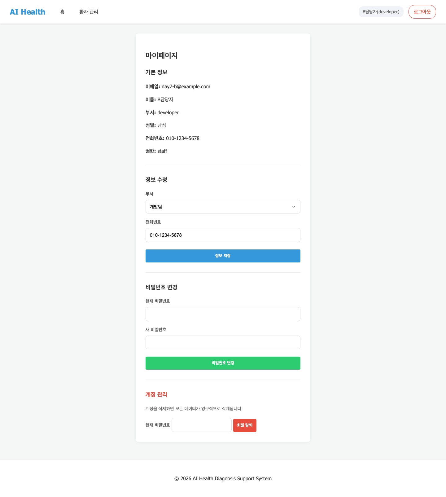
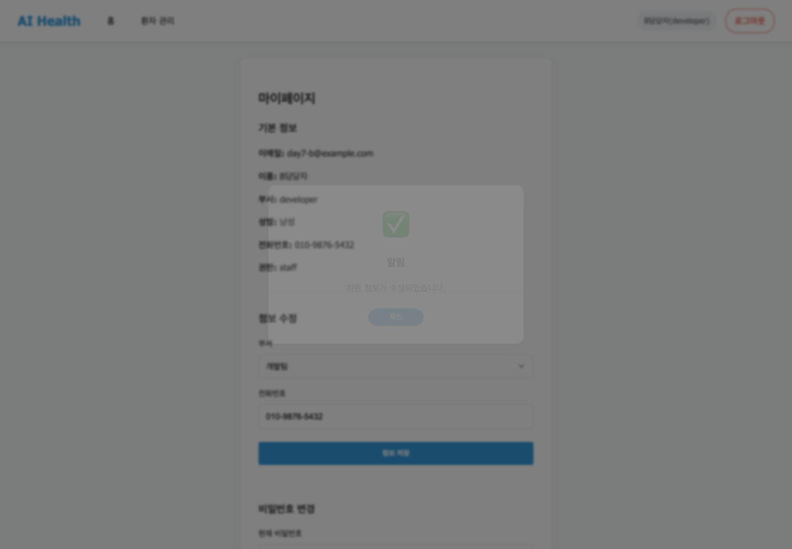
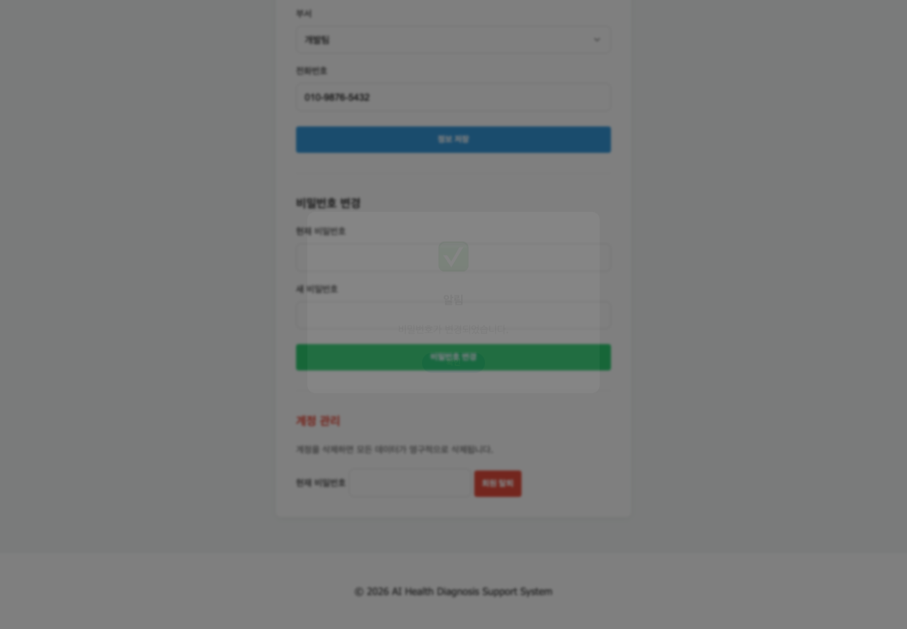
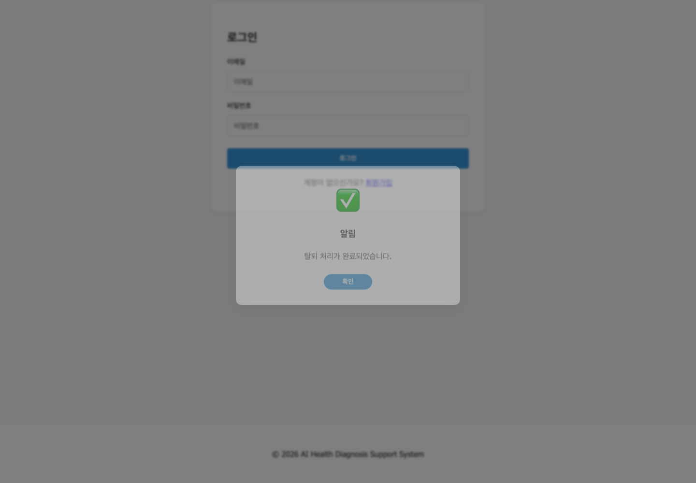

# 7일차 앱 실행 화면 - B 담당

## 담당 범위

- `home.html`: 로그인 상태에 따른 홈 화면 동작
- `my-page.html`: 내 정보 조회, 정보 수정, 비밀번호 변경, 회원 탈퇴

FastAPI 앱을 `http://127.0.0.1:8000`에서 실행하고 일반 사용자 계정으로 로그인하여 확인했다.

## 1. 내 정보 조회 - 홈

- Endpoint: `GET /api/v1/users/me`
- 호출 함수: `apis.getMe()`
- 동작: 앱 진입 시 `checkAuth()`가 로그인 사용자 정보를 조회해 `state.user`에 저장한다. 홈 화면은 사용자 권한이 `staff` 또는 `admin`이면 **환자 목록 보기** 버튼을 표시한다.
- 확인 결과: 로그인 사용자 이름과 부서가 상단에 표시되고 환자 목록 버튼이 정상 렌더링됐다.

## 2. 내 정보 조회 - 마이페이지

- Endpoint: `GET /api/v1/users/me`
- 호출 함수: `apis.getMe()`
- 동작: 조회한 `state.user`를 사용해 이메일, 이름, 부서, 성별, 전화번호, 권한을 표시하고 수정 폼의 초기값을 채운다.
- 확인 결과: 로그인 사용자의 정보가 마이페이지에 정상 표시됐다.

## 3. 내 정보 수정

- Endpoint: `PATCH /api/v1/users/me`
- 호출 함수: `apis.updateMe()`
- 요청 데이터: `department`, `phone_number`
- 동작: 정보 저장 버튼을 누르면 부서와 전화번호를 수정하고, 성공 후 `checkAuth()`를 다시 호출해 화면과 상단 사용자 정보를 갱신한다.
- 확인 결과: HTTP `200 OK` 응답을 받았고 전화번호가 `010-9876-5432`로 변경됐으며 성공 알림이 표시됐다.

## 4. 비밀번호 변경

- Endpoint: `PATCH /api/v1/users/me/password`
- 호출 함수: `apis.updatePassword()`
- 요청 데이터: `current_password`, `new_password`
- 동작: 현재 비밀번호를 확인한 뒤 정책을 만족하는 새 비밀번호로 변경한다. 성공하면 입력 폼을 초기화한다.
- 확인 결과: HTTP `200 OK` 응답을 받았고 비밀번호 변경 성공 알림이 표시됐다.

## 5. 회원 탈퇴

- Endpoint: `DELETE /api/v1/users/me`
- 호출 함수: `apis.deleteMe()`
- 요청 데이터: `current_password`
- 동작: 현재 비밀번호 입력과 브라우저 확인을 거친 뒤 계정을 삭제한다. 성공하면 인증 상태를 정리하고 로그인 화면으로 이동한다.
- 확인 결과: HTTP `204 No Content` 응답을 받았고 탈퇴 완료 알림과 로그인 화면 이동을 확인했다.

## 실행 결과

| 화면 | Endpoint | 결과 |
| --- | --- | --- |
| 홈 / 마이페이지 | `GET /api/v1/users/me` | `200 OK` |
| 마이페이지 정보 수정 | `PATCH /api/v1/users/me` | `200 OK` |
| 마이페이지 비밀번호 변경 | `PATCH /api/v1/users/me/password` | `200 OK` |
| 마이페이지 회원 탈퇴 | `DELETE /api/v1/users/me` | `204 No Content` |

