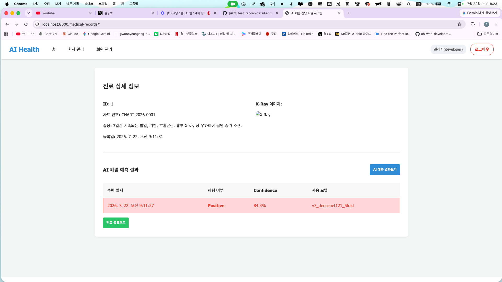
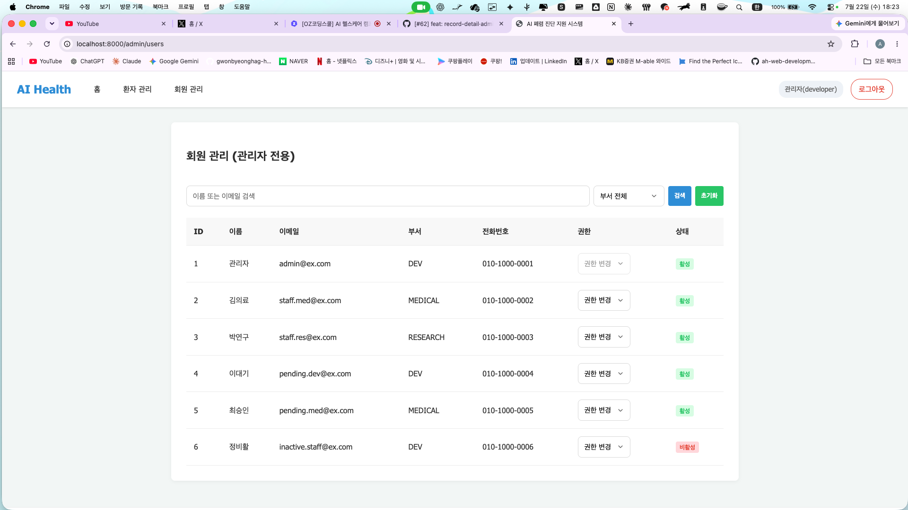

# 7일차 앱 실행화면 — record-detail · admin-users (Stage7 E)

- 관련 이슈: #62 / PR: #63
- 담당 화면 2개(진료 상세, 회원 관리)의 프론트↔서버 API 연결 및 리뷰 반영 결과를 실제 실행화면으로 기록한다.
- 로컬 서버(`fastapi run`, `:8000`)에 시드 데이터를 넣고 관리자 계정으로 접속해 캡처했다.

---

## 1. 진료 상세 (record-detail) — `/medical-records/1`

- **표시되는 정보**: 진료기록 ID, 차트번호(`CHART-2026-0001`), 증상, 등록일.
- **AI 폐렴 예측 결과표**: `GET /medical-records/{id}/predictions` 응답을 표로 렌더.
  - 예측 경로를 `…/predict` → `…/predictions` 로 정정.
  - 응답이 배열이 아니라 `{items, page, size, total}` 이므로 `items` 를 순회.
  - 수행 일시 필드는 `created_at` 이 아니라 서버 필드명 `predicted_at` 을 사용.
  - 캡처 예시: `Positive`, Confidence `84.3%`, 사용 모델 `v7_densenet121_5fold`.
- **X-Ray 이미지는 표시되지 않음(의도된 현재 한계)**:
  - `GET /medical-records/{id}` 응답의 `xray_image_url` 이 **항상 `null`** 이다.
    (백엔드가 "X-Ray 조회 정책 확정 전까지 `None` 반환" 으로 구현 — 목록/상세에 이미지 URL 미포함)
  - 프론트는 `record.xray_image_url` 을 `` 에 넣으므로 값이 `null` 이면 위 캡처처럼 이미지가 깨져 보인다.
  - 이는 백엔드 정책(은영님 파트) 확정 후 상세 응답에 `xray_image_url` 을 채우면 해결된다. 프론트 수정 사항 아님.

## 2. 회원 관리 (admin-users) — `/admin/users` (관리자 전용)

- **회원 목록**: `GET /admin/users` 응답이 `{items, …}` 이므로 `items` 를 순회. 6명(다양한 부서·활성/비활성) 표시.
- **부서 필터**: option `value` 를 서버 `Department` enum(`DEV`/`MEDICAL`/`RESEARCH`)으로 맞춤.
  - (리뷰 반영) 기존 `developer`/`medical team`/`researcher` 값은 서버 enum과 불일치해 부서 필터 시 **422** 가 났음.
- **검색**: 쿼리 파라미터명을 `query` → `search` 로 정정(서버 파라미터명 일치). 이전엔 서버가 무시해 이름/이메일 검색이 동작하지 않았음.
- **권한(role) 드롭다운**: 맨 위 `권한 변경` placeholder 로 표시.
  - (리뷰 반영) `GET /admin/users` 목록 응답에는 `role` 이 **포함되지 않는다**(REQ-USER-004 스펙). 따라서 각 회원의 현재 권한을 드롭다운에 **미리 선택(preselect)할 수 없음**.
  - "현재 권한 표시"가 아니라 "권한을 변경" 하는 UI 로 바꾸고, placeholder(빈값) 선택 시 빈 role 전송을 막는 가드를 추가.
  - 권한 변경 동작 자체(`PATCH /admin/users/{id}/role`, 소문자 value → 대문자 enum 전송)는 정상.

---

### 검증 요약
- 4개 API E2E 200 확인: `GET/POST …/predictions`, `GET /admin/users`, `PATCH /admin/users/{id}/role`.
- 부서 필터: `?department=DEV` → 200(필터됨), 기존 `?department=developer` → 422(버그 재현).
- 검색: `?search=` 정상 필터, 기존 `?query=` → 서버 무시(버그 재현).
- 변경 범위: 프론트(`static/`)만. 백엔드(`app/`)·DB 무변경.
