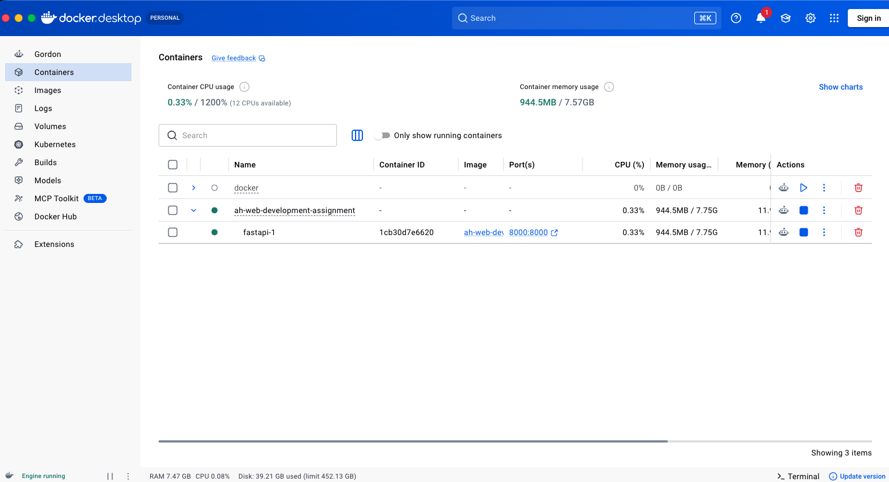

# 8일차 - 도커 설정 실행화면

## Dockerfile 이미지 빌드 및 컨테이너 실행

`docker compose up --build`를 통해 이미지 빌드 후 컨테이너가 정상 실행되는 모습입니다.

### 실행 환경 정보

| 항목 | 내용 |
|------|------|
| 실행 명령어 | `docker compose up --build` |
| FastAPI 서비스 포트 | `8000` |
| 볼륨 마운트 | `./:/app` |
| 코드 자동 반영 | `--reload` 옵션 적용 |
