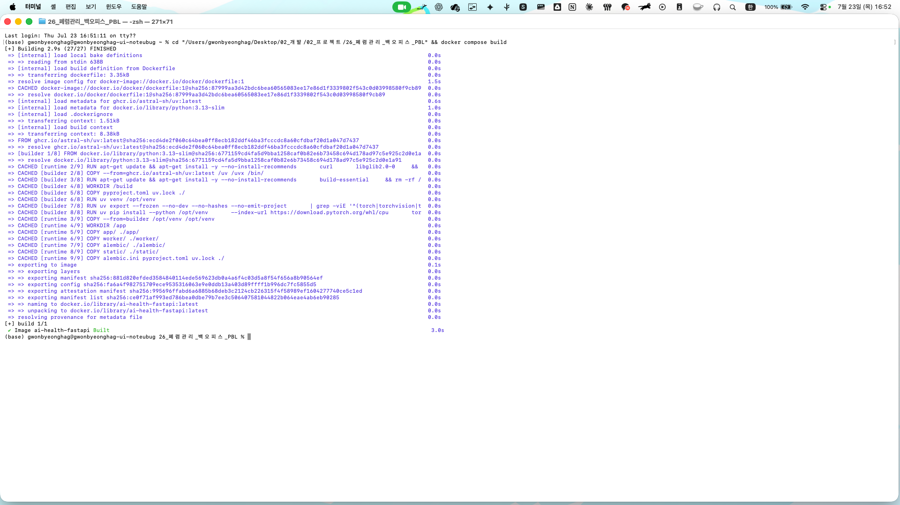
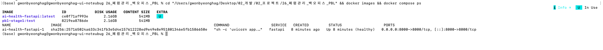

# 8일차 - Docker 컨테이너화

## 이미지 빌드 (Dockerfile)

- `docker compose build` 성공. 멀티스테이지(builder/runtime)로 빌드.
- torch/torchvision 을 CPU 전용 휠(`--index-url .../whl/cpu`)로 설치해 이미지 경량화.
  lock 기본 의존성 그대로면 nvidia/cuda 패키지가 딸려와 5GB+ → 최종 2.16GB.
- 의존성은 `/opt/venv` 에 설치(= /app 밖). compose 가 프로젝트 루트를 `/app` 에 마운트하므로,
  /app 안에 설치하면 마운트가 패키지를 덮어써 런타임에 사라지기 때문.
- `worker/models/*.pth` (5개, 136MB)는 이미지에 포함. app/main.py 가
  `from worker.model import load_models` 로 로드하므로 필수.

## 컨테이너 실행 (docker compose)

- `docker compose up -d` → `Up (healthy)`, 8000 포트 매핑 확인.
- `/healthcheck` 200 `{"status":"ok"}`
- 컨테이너 내부에서 `from worker.model import MODEL_TAG` → `v7_densenet121_5fold` 확인
  (모델 가중치가 이미지에 정상 포함됨을 검증)

## .dockerignore

- 빌드 컨텍스트 루트(`./.dockerignore`)에 배치. compose 의 context 가 `.` 이라
  Docker 가 이 위치를 사용한다(빌드 로그 `load .dockerignore` 로 확인).
- 제외: env 파일 / 파이썬 캐시 / 라이브러리 캐시(mypy·ruff·pytest) / 도커 설정 파일 /
  docs / README.md / IDE 설정 / `.venv` / `*.db` / `.git` / media / tests
- `worker/models` 는 제외하지 않음(런타임 필수).

## docker-compose.yml 변경 사항

- mysql 서비스 삭제 (팀이 SQLite 로 확정, 앱이 mysql 을 사용하지 않음).
  함께 fastapi 의 `depends_on` 과 volumes 의 `mysql_volume` 도 제거.
- 볼륨을 `./app:/app` → `.:/app` 로 변경. 두 가지 이유:
  1. 기존 설정은 `/app` 을 호스트 app/ 로 덮어써 worker/ 가 사라져
     `from worker.model import` 가 실패한다.
  2. `DB_PATH="./ai_health.db"` 가 CWD(/app) 기준이라, 루트를 마운트해야
     호스트의 db 파일과 같은 위치가 되어 데이터가 유지된다.
- `name: ai-health` 추가 — compose 프로젝트명을 고정(폴더명에 따라 무효한 이미지 태그가
  생성되는 것을 방지).
